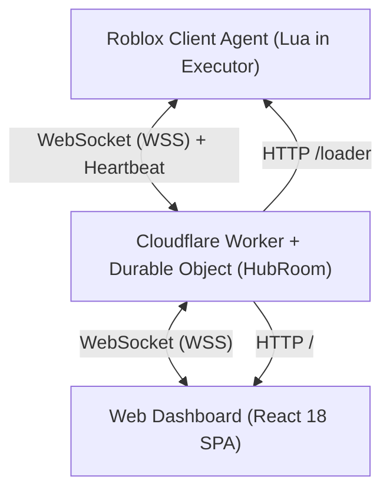

# AGENTS.md — OneEight External Hub Architecture & Development Guide

> **MANDATORY READING FOR ALL DEVELOPERS & AI AGENTS**  
> Dokumen ini adalah Single Source of Truth (SSOT) arsitektur, standar coding, siklus build, dan protokol komunikasi untuk project **OE Hub-External** (OneEight External Hub).  
> **JANGAN PERNAH RECODE DARI AWAL!** Ikuti panduan modular yang sudah established di sini.

---

## 1. Overview & Arsitektur Sistem

OneEight External Hub adalah sistem remote control, live telemetry monitoring, dan otomasi multi-bot untuk game Roblox (fokus utama: **Car Driving Indonesia / CDID**, dengan arsitektur modular yang siap untuk game lain seperti DDS).

Sistem terdiri dari 3 pilar utama:


1. **Client Agent (`client/`)**: Skrip Luau modular yang di-inject di executor (Delta, Fluxus, Synapse, dll). Menghubungkan bot langsung ke Cloudflare via WebSocket C++ native.
2. **Edge Hub Server (`src/`)**: Cloudflare Worker dengan **Durable Object (`HubRoom`)** sebagai message broker real-time, session manager, API proxy, dan static web host.
3. **Frontend Dashboard (`frontend/`)**: Web Dashboard SPA (Single Page Application) dibangun dengan Vite, React 18, TailwindCSS, Radix UI, dan Lucide Icons, dibundel menjadi single-file HTML.

---

## 2. Struktur Direktori & File

```
OE Hub-External/
├── .gitignore
├── package.json               # Root scripts ("build:frontend", "deploy")
├── wrangler.toml              # Konfigurasi Cloudflare Worker & Durable Object
├── AGENTS.md                  # Panduan pengembang & AI Agent (file ini)
│
├── client/                    # SOURCE CODE CLIENT ROBLOX (LUA)
│   ├── agent.lua              # Master bundle agent (hasil generate update_agent.js + core runtime)
│   ├── core/
│   │   └── safety.lua         # Anti-AFK, Kick Detector, Safe Rejoin helper
│   └── games/
│       ├── base_game.lua      # Interface Contract untuk semua game modul
│       └── cdid/
│           ├── init.lua       # Main Coordinator CDID (orchestrator sub-modul)
│           ├── menu.lua       # CDID Main Menu / Lobby handler (Auto-join Jatim, kode server)
│           ├── features/
│           │   ├── dealership.lua # Scraper katalog mobil dealer & remote purchase
│           │   ├── lighting.lua   # Visuals (Fullbright, NoFog)
│           │   ├── safety.lua     # Anti-car flip, auto seat, server lock
│           │   └── teleport.lua   # Helper teleportasi aman
│           └── jobs/
│               └── truck.lua      # Cargo / Truck Driver auto-farm engine (SSOT payout & speed)
│
├── frontend/                  # SOURCE CODE WEB DASHBOARD (REACT 18 + VITE)
│   ├── package.json           # Dependencies UI (Radix, Lucide, Tailwind, Vite)
│   ├── vite.config.js         # Single-file HTML bundler (vite-plugin-singlefile)
│   ├── tailwind.config.js     # Styling tokens & themes
│   └── src/
│       ├── App.jsx            # Main app container & routing view
│       ├── main.jsx           # Entrypoint React
│       ├── config/
│       │   └── games.js       # Game definitions & supported features
│       ├── hooks/
│       │   └── useWebSocketHub.js # Hook koneksi WebSocket ke Hub Durable Object
│       └── components/
│           ├── Navbar.jsx     # Header status & navigation
│           ├── Sidebar.jsx    # Bot selector & stats summary
│           ├── FleetOverview.jsx # Grid view semua bot yang terhubung
│           ├── BotDetailView.jsx # Detail bot terpilih & tab controller
│           ├── DealershipPage.jsx # Katalog dealer mobil terintegrasi
│           └── tabs/
│               ├── CDIDFarmTab.jsx   # Kontrol Trucking (Start/Stop, Speed, Min Distance)
│               ├── CDIDMenuTab.jsx   # Kontrol Lobi CDID (Auto-join Jawa Timur)
│               ├── SafetyTab.jsx     # Keamanan (Anti-flip, Server lock, Rejoin)
│               ├── PerfTab.jsx       # Visual & FPS booster (Fullbright, No fog)
│               └── ConsoleTab.jsx    # Live log terminal dari executor
│
├── src/                       # CLOUDFLARE WORKER & BACKEND API
│   ├── index.js               # Entry worker & implementasi Durable Object (HubRoom)
│   ├── agent_code.js          # Export AGENT_LUA string (di-serve di endpoint /loader)
│   ├── dashboard.html         # Single-file HTML hasil build frontend (di-serve di endpoint /)
│   ├── dashboard.js           # Helper export dashboard.html
│   ├── api/
│   │   └── router.js          # HTTP API dispatcher (/api/roblox/*)
│   └── services/
│       └── roblox.js          # Service resolver avatar & username Roblox
│
└── scripts/                   # BUILD & BUNDLING AUTOMATION
    ├── update_agent.js        # Memasukkan sub-modul client/ ke agent.lua & agent_code.js
    └── sync_dashboard.js      # Copy frontend/dist/index.html ke src/dashboard.html
```

---

## 3. Workflow Pengembangan & Aturan Wajib (Invariants)

### ⚠️ ATURAN 1: Jangan Edit Sub-Modul Langsung di `agent.lua`
- Kode modular terbagi di `client/core/` dan `client/games/`.
- Jika ingin memodifikasi fitur CDID Trucking: edit `client/games/cdid/jobs/truck.lua`.
- Jika ingin mengubah menu lobi: edit `client/games/cdid/menu.lua`.
- Jika ingin mengubah safety/kick: edit `client/core/safety.lua`.
- **SETELAH EDIT LUA SUB-MODUL:** Anda **WAJIB** menjalankan:
  ```bash
  node ./scripts/update_agent.js
  ```
  Script ini akan otomatis menginjeksi sub-modul ke dalam `client/agent.lua` dan memperbarui `src/agent_code.js`.

### ⚠️ ATURAN 2: Alur Build & Deploy Frontend
- **JANGAN PERNAH** mengedit `src/dashboard.html` secara manual! File itu adalah hasil kompilasi single-file dari Vite.
- Setiap kali mengubah komponen atau styling di `frontend/src/`:
  ```bash
  npm run build:frontend
  ```
  Script ini menjalankan: `npm --prefix frontend run build && node ./scripts/sync_dashboard.js`.
- Untuk deploy ke Cloudflare Workers:
  ```bash
  npm run deploy
  # atau
  npx wrangler deploy
  ```

### ⚠️ ATURAN 3: Stabilitas WebSocket & Anti-Duel Session
Koneksi WebSocket antara Client Roblox dan Cloudflare Durable Object memiliki sistem proteksi yang tidak boleh dirusak:
1. **Heartbeat PING/PONG (5 Detik):** Client mengirim `{ type: "PING" }` setiap 5 detik. Server membalas `{ type: "PONG" }` dan menyegarkan `lastSeen`.
2. **Anti-Duel Session Guard:** Jika ada bot baru dengan username yang sama terhubung:
   - Server mengirim `{ type: "FORCE_DISCONNECT", reason: "SUPERSEDED" }` ke sesi lama.
   - Server menutup socket lama dengan code `4001` (`"Session replaced by new connection"`).
   - Client sesi lama **segera menyetel `CoreState.IsTerminated = true` dan berhenti rekoneksi permanen**.
3. **Telemetry Throttling:** Interval telemetry diatur ke **1.5 detik**. Jangan percepat di bawah 1 detik agar tidak menyebabkan buffer overflow pada executor C++ layer.
4. **Reconnection Jitter:** Jika disconnect tidak disengaja, client menunggu `math.random(3, 5)` detik sebelum mencoba rekoneksi.

---

## 4. Spesifikasi Protokol WebSocket & Paket

### A. URL Koneksi
- **Bot Agent:**  
  `wss://<domain>/ws?role=bot&name=<PlayerName>&gameId=<gameId>&gameName=<gameName>&placeId=<placeId>`
- **Web Controller Dashboard:**  
  `wss://<domain>/ws?role=controller`

### B. Paket dari Server ke Bot (`EXECUTE_COMMAND`)
Format: `{ type: "EXECUTE_COMMAND", action: "<ACTION_NAME>", payload: { ... } }`

| Action | Payload | Keterangan |
| :--- | :--- | :--- |
| `START_FARM` | `{}` | Menjalankan auto-farm trucking / cargo |
| `STOP_FARM` | `{}` | Menghentikan auto-farm |
| `TELEPORT_HQ` | `{}` | Teleportasi instan ke markas cargo CDID |
| `SET_SPEED` | `{ speed: number }` | Mengatur kecepatan gerak cargo (default: 135) |
| `SET_MIN_DIST` | `{ distance: number }` | Filter jarak minimum rute cargo |
| `TOGGLE_CAR_FLIP` | `{}` | On/Off pencegah mobil terbalik |
| `TOGGLE_AUTO_SEAT` | `{}` | On/Off otomatis masuk kursi pengemudi |
| `TOGGLE_SERVER_LOCK` | `{}` | On/Off gembok server agar orang lain tidak bisa masuk |
| `SET_FULLBRIGHT` | `{ enable: boolean }` | Mengatur pencahayaan fullbright |
| `SET_NO_FOG` | `{ enable: boolean }` | Mengatur penghapusan kabut |
| `BUY_CAR` | `{ dealer: string, carName: string }` | Membeli mobil dari dealer secara remote |
| `FETCH_DEALER_CARS` | `{ dealer: string }` | Meminta bot melakukan scrape katalog mobil |
| `TOGGLE_AUTO_JOIN_JATIM` | `{}` | (Lobby CDID) On/Off auto teleport ke Jawa Timur |
| `INPUT_SERVER_CODE` | `{ code: string }` | (Lobby CDID) Input kode server private |
| `FORCE_DISCONNECT` | `{ reason: string }` | Memberitahu client sesi digantikan koneksi baru |

### C. Paket dari Bot ke Server
1. **`TELEMETRY`**: Mengirim state real-time (setiap 1.5 detik)
   ```json
   {
     "type": "TELEMETRY",
     "payload": {
       "status": "RUNNING | READY | STOPPED | KICKED",
       "isFarming": true,
       "tripCount": 12,
       "totalEarnings": 45000000,
       "currentCash": 125000000,
       "currentRoute": "Surabaya -> Malang",
       "sessionTime": "01:23:45",
       "sessionSeconds": 5025,
       "isKicked": false,
       "kickReason": null,
       "autoRejoin": true,
       "gameId": "cdid",
       "gameName": "CDID Jawa Timur",
       "currencyUnit": "Rp",
       "metricUnit": "Trips",
       "placeId": "110369730911937"
     }
   }
   ```
2. **`LOG`**: Mengirim log text dari bot ke console web dashboard
   ```json
   {
     "type": "LOG",
     "message": "Trip selesai! Payout diterima: Rp 3.500.000",
     "level": "INFO | SUCCESS | WARN | ERROR"
   }
   ```
3. **`CLIENT_KICKED`**: Notifikasi bot terputus atau kena kick Roblox
4. **`DEALER_CARS_DATA`**: Daftar katalog mobil dealer yang berhasil di-scrape
5. **`PING`**: Heartbeat menjaga socket edge tetap hidup

---

## 5. Cara Menambahkan Game Baru (Multi-Game Architecture)

Untuk menambahkan game baru (misal: **Drag Drive Simulator / DDS**, **Blox Fruits**, dll):

1. **Buat Game Modul di `client/games/<game_id>/init.lua`**:
   Ikuti kontrak `client/games/base_game.lua`:
   - `Game.New(gameId, gameName, currencyUnit, metricUnit)`
   - `Init(coreContext)`
   - `HandleCommand(action, payload)` -> return `true` jika perintah dikenali
   - `GetTelemetry()` -> return tabel state
   - `Cleanup()`

2. **Daftarkan Game di `client/agent.lua`**:
   Tambahkan deteksi `game.PlaceId` di bagian:
   ```lua
   if placeId == YOUR_PLACE_ID then
       activeGameModule = requireModule("games/your_game")
   ```

3. **Daftarkan UI Game di `frontend/src/config/games.js`**:
   Tambahkan konfigurasi tab kontrol spesifik game di frontend React.

4. **Kompilasi & Deploy**:
   ```bash
   node ./scripts/update_agent.js
   npm run deploy
   ```

---

## 6. Tips & Gotchas Penting untuk AI Agent

1. **Karakter Path Windows `#`:**
   Folder project ini berada di `C:\Users\ASRock\Documents\1#MYHUB\OE Hub-External`. Karakter `#` pada nama folder dapat memicu masalah escaping pada beberapa shell tool (misal ripgrep tanpa flag regex off). Selalu gunakan path lengkap dan tanda kutip ganda pada perintah terminal.
2. **Single-File Requirement:**
   Cloudflare Worker menyajikan dashboard langsung dari memori via `src/dashboard.html`. Jangan gunakan multi-file bundle konvensional di frontend tanpa plugin `vite-plugin-singlefile`.
3. **SSOT Cash Delta:**
   Perhitungan payout uang trucking CDID menggunakan delta cash nyata dari leaderstats / LocalPlayer stats, bukan simulasi angka fiktif. Jangan ubah logika delta ini agar nilai pendapatan di dashboard selalu 100% akurat.
4. **Zero-Downtime Deployment:**
   Deploy Cloudflare Worker bersifat atomik dan instan. Setelah deploy, bot yang sedang aktif tidak perlu restart jika hanya frontend yang diubah. Jika `agent.lua` diubah, bot akan mendapatkan versi terbaru saat loader di-eksekusi ulang.

---
*Dokumen ini dibuat dan dikelola untuk memastikan konsistensi kode dan arsitektur OneEight External Hub.*
